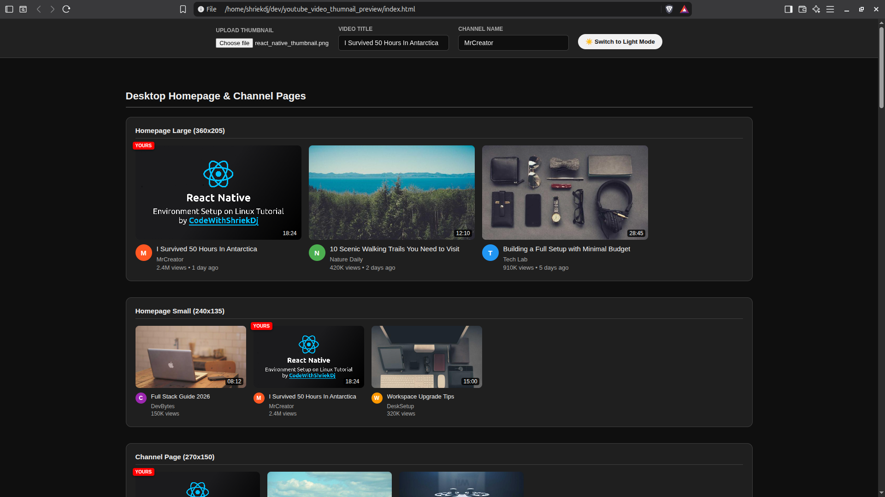

# YouTube Thumbnail Preview Tool

A web-based tool to preview how YouTube video thumbnail images and titles will appear across different screens and pages — desktop, mobile, search, watch later, and Apple TV/TV.

## Features

- **Multiple screen layouts**: Preview thumbnails on desktop homepage, channel pages, search results, sidebar suggested videos, watch later, and Apple TV/smart TV
- **Upload custom thumbnails**: Drag and drop or select an image to use as your video thumbnail
- **Dynamic title/channel editing**: Edit the video title and channel name and see updates reflected across all preview layouts in real-time
- **Dark/Light theme toggle**: Switch between dark and light color themes
- **Responsive previews**: See how thumbnails appear on various aspect ratios and sizes from 168x94 up to 512x288

## Supported Layouts

### Desktop
- Homepage Large (360x205)
- Homepage Small (240x135)
- Channel Page (270x150, 198x112)
- Search Result Large (360x202)
- Search Result Small (240x135)
- Sidebar Suggested Video (168x94)
- Watch Later (540x106)

### Mobile
- Mobile Homepage (320x180)
- Mobile Search (320x180)
- Mobile Suggested (168x94)

### Apple TV & Smart TV
- Apple TV Homepage (512x288)
- Apple TV Recommended (512x288)
- Apple TV Watch Later (360x200)

## How to Use

1. Open `index.html` in a web browser
2. (Optional) Upload a custom thumbnail image using the file upload
3. Edit the video title and channel name in the toolbar at the top
4. Toggle dark/light mode using the sun/moon button
5. Scroll through the preview sections to see how your thumbnail and title appear across different YouTube pages and devices

## Tech Stack

- HTML5 / CSS3 / Vanilla JavaScript
- CSS custom properties for theming
- SVG placeholder thumbnails when no image is uploaded

## Screenshot

## License

MIT
